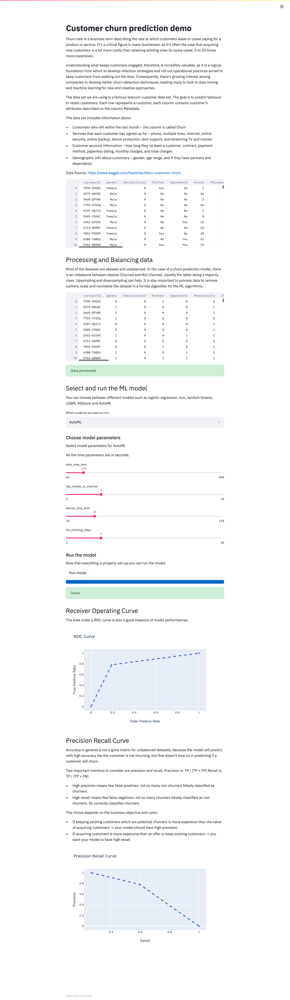

# Churn_interactive_demo
Retail churn prediction interactive demo

Installation
------------

This app can run on Python 3.7+ Install it with ``pip``:

To get the dependencies: ::

  pip install -r requirements.txt 

Usage
-----
The app is based on streamlit. So just run its server:

    streamlit run app.py

App
-----
